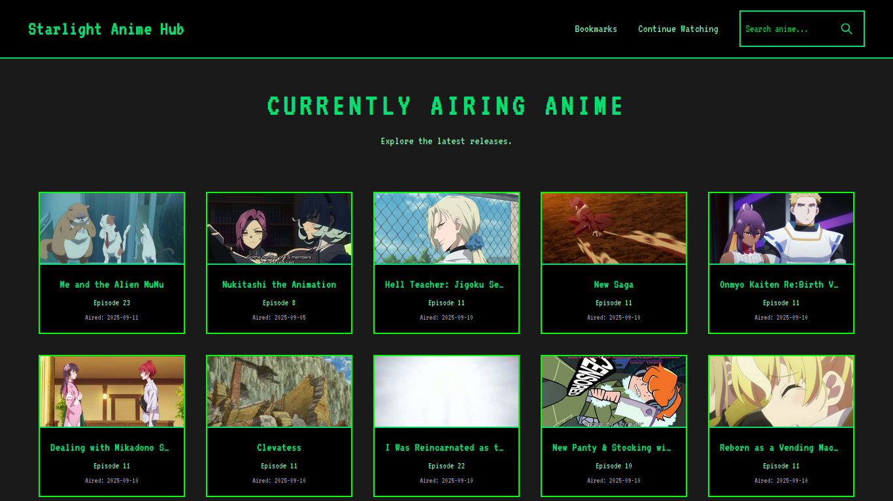
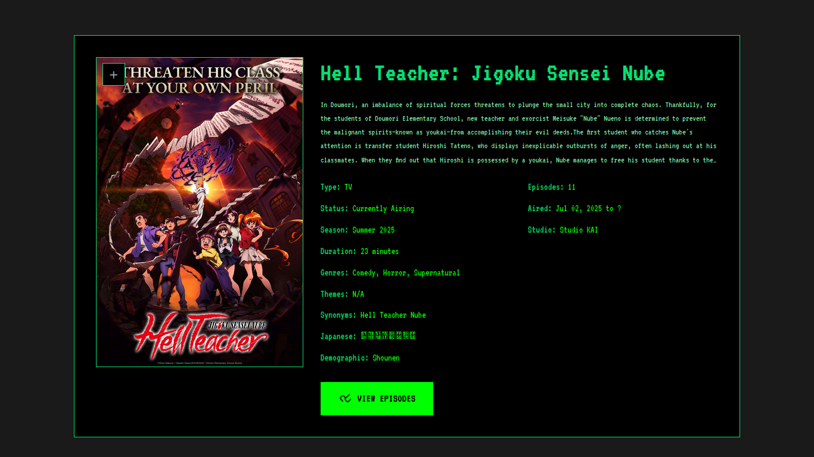

# Starlight Anime Hub

A web application for discovering and downloading anime. Built with Flask and Tailwind CSS, featuring a dark-themed, responsive interface.

## Live Demo

[https://starlight-anime-hub.vercel.app/](https://starlight-anime-hub.vercel.app/)

## Features

### Discover & Search
- **Powerful Search**: Find any anime instantly by title
- **Currently Airing**: Browse ongoing series with the latest episodes
- **Detailed Pages**: Explore synopsis, genres, status, related anime, and recommendations

### Downloads
- **Episode Listings**: Browse all episodes for any anime series
- **Download Links**: Get direct download links for offline viewing

### Personalization
- **Bookmarks**: Save favorite anime with one click, stored locally in your browser
- **Continue Watching**: View unwatched episodes from your bookmarked anime
- **Responsive Design**: Seamless experience across desktop, tablet, and mobile

### Technical Highlights
- **Fast & Modern**: Clean UI with smooth animations and intuitive navigation
- **Image Proxying**: Securely loads external images without CORS restrictions
- **Interactive Modals**: Dynamic episode options and download interfaces

## How to Use

1. **Search**: Use the navigation search bar to find anime by title
2. **Browse**: The homepage displays currently airing anime - use pagination to explore
3. **Explore**: Click any anime card to view details, episodes, and recommendations
4. **Download**: Select episodes to view download link options
5. **Bookmark**: Click the star icon on anime cards to save them for quick access
6. **Continue Watching**: Visit the Continue Watching page to see unwatched episodes from your bookmarks

## Screenshots

### Home Page

### Anime Details Page

### Episode Selection

### Bookmarks Page

